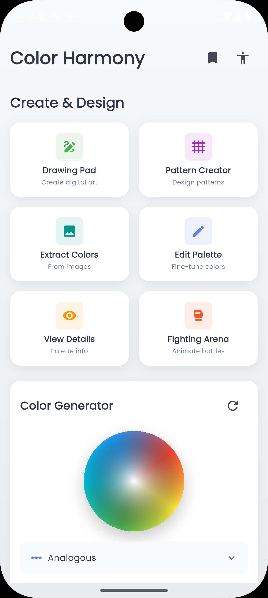
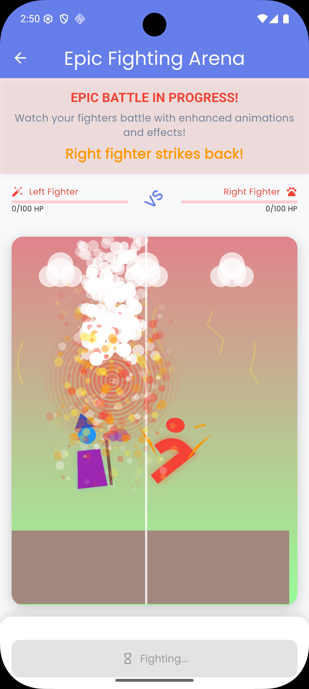
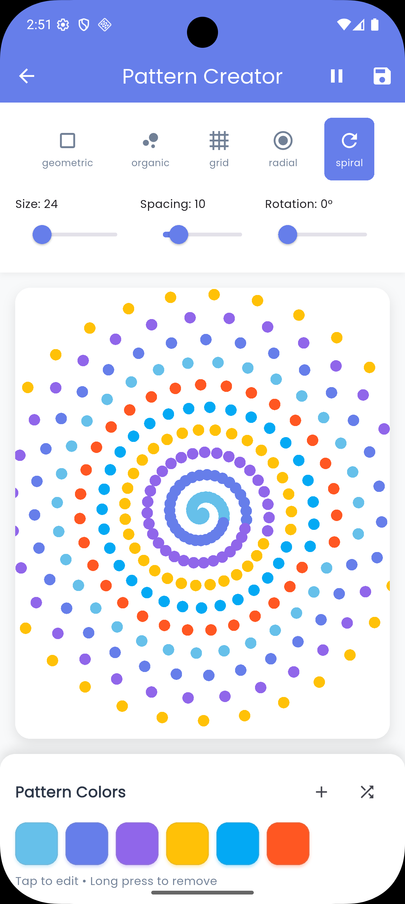
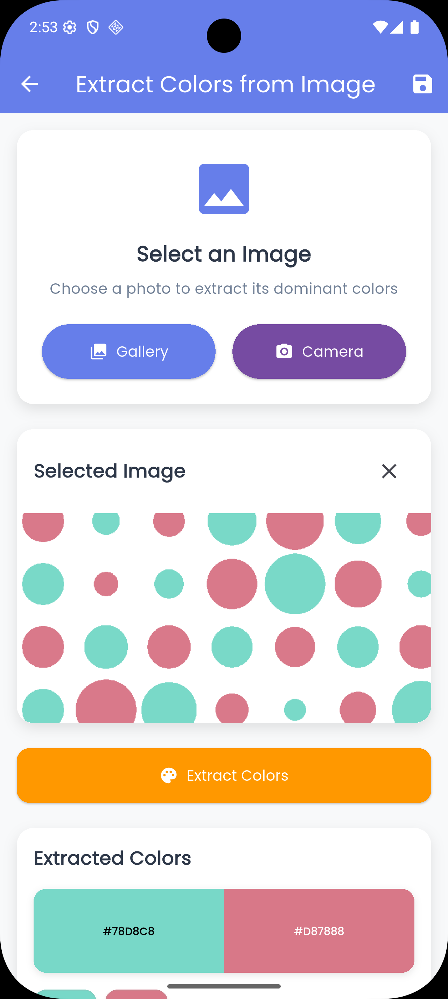

# Color Harmony 🎨

## Screenshots
<div align="center">
 
 

 
</div>

## Installation

### Prerequisites
- Flutter SDK (3.10.0 or higher)
- Dart SDK (3.0.0 or higher)
- Android Studio / VS Code

### Setup
```bash
git clone https://github.com/akshat2474/ColorHarmony
cd color_harmony
flutter pub get
flutter run
```

## Project Structure

```
lib/
├── main.dart                          
├── models/                            
│   ├── color_palette.dart            
│   ├── color_harmony.dart             
│   └── accessibility_result.dart     
├── screens/               
│   ├── home_screen.dart              
│   ├── drawing_pad_screen.dart        
│   ├── pattern_creator_screen.dart
│   ├── animated_fighting_screen.dart  
│   ├── image_color_extractor_screen.dart 
│   ├── palette_generator_screen.dart  
│   ├── palette_detail_screen.dart    
│   ├── saved_palettes_screen.dart 
│   └── accessibility_checker_screen.dart
├── widgets/                        
│   ├── color_wheel.dart             
│   ├── color_swatch.dart             
│   ├── palette_card.dart            
│   └── harmony_selector.dart         
├── services/                  
│   ├── color_service.dart            
│   ├── palette_storage_service.dart   
│   └── accessibility_service.dart    
└── utils/                            
    ├── color_utils.dart              
    ├── constants.dart             
    └── theme.dart          
```

## Key Dependencies

```yaml
dependencies:
  flutter:
    sdk: flutter
  flutter_colorpicker: ^1.0.3         
  shared_preferences: ^2.2.2          
  flutter_staggered_animations: ^1.1.1 
  gal: ^2.3.0                          
  image_picker: ^1.0.4                 
  palette_generator: ^0.3.3+3         
  path_provider: ^2.1.1               
  share_plus: ^7.2.1                  
  google_fonts: ^6.1.0                
```

## Usage Guide

### Creating Your First Palette
1. **Launch the app** - Experience the animated home screen
2. **Select a base color** - Use the interactive color wheel
3. **Choose harmony type** - Pick from 6 different algorithms
4. **View generated palette** - See colors with hex codes instantly
5. **Fine-tune colors** - Use advanced editing tools
6. **Save your work** - Store palettes for future reference

### Drawing & Creative Features
- **Drawing Pad**: Create digital art with brushes, shapes, and text tools
- **Pattern Creator**: Generate seamless patterns for design projects
- **Fighting Arena**: Draw custom fighters and watch animated battles
- **Color Extraction**: Import photos and extract dominant colors

### Professional Tools
- **Accessibility Testing**: Ensure WCAG compliance with contrast analysis
- **Palette Management**: Organize and search your color collections
- **Export Options**: Save to gallery or share with design teams

## Accessibility Features

- **WCAG AA/AAA Compliance** - Test color combinations against web standards
- **Contrast Ratio Calculator** - Real-time accessibility analysis
- **Color Blind Friendly** - Ensure designs work for all users
- **Professional Recommendations** - Intelligent suggestions for better accessibility

## License

This project is licensed under the MIT License - see the [LICENSE](LICENSE) file for details.

## Author

**Akshat Singh**
- GitHub: [@akshat2474](https://github.com/akshat2474)
- Email: akshatsingh2474@gmail.com


