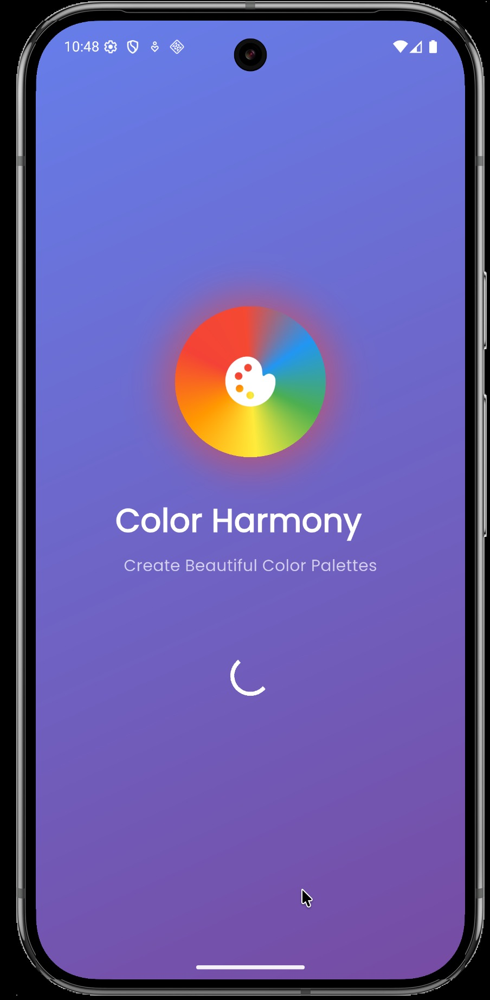
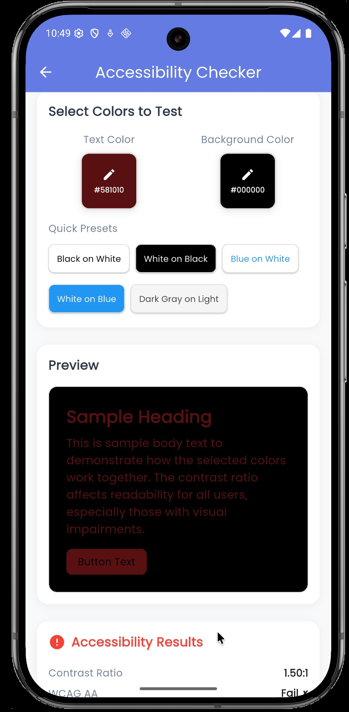

# Color Harmony 🎨

**An advanced color palette generator app designed for designers and artists to create beautiful, accessible, and professional color palettes.**

## Screenshots

<div align="center">
Main Interface

 

 

 
</div>
 
## Features

- **Interactive Color Wheel** - Select base colors with precision using an animated color wheel
- **Multiple Harmony Types** - Generate palettes using complementary, analogous, triadic, tetradic, split complementary, and monochromatic harmonies
- **Real-time Generation** - Instant palette creation and live editing with smooth animations
- **Palette Management** - Save, organize, search, and share your favorite color combinations
- **Accessibility Checker** - WCAG compliance testing with contrast ratio analysis
- **Advanced Color Picker** - Fine-tune colors with HSL sliders and preset swatches
- **Export & Share** - Share palettes across platforms and copy hex codes instantly

## Installation

### Prerequisites
- Flutter SDK (3.10.0 or higher)
- Dart SDK (3.0.0 or higher)
- Android Studio / VS Code

### Setup
```bash
git clone https://github.com/yourusername/color_harmony.git
cd color_harmony
flutter pub get
flutter run
```

## Project Structure

```
lib/
├── main.dart                    
├── models/                     
│   ├── color_palette.dart      
│   ├── color_harmony.dart       
│   └── accessibility_result.dart 
├── screens/                    
│   ├── splash_screen.dart      
│   ├── home_screen.dart        
│   ├── palette_generator_screen.dart
│   ├── palette_detail_screen.dart    
│   ├── saved_palettes_screen.dart    
│   ├── accessibility_checker_screen.dart 
│   └── color_picker_screen.dart     
├── widgets/                     
│   ├── color_wheel.dart         
│   ├── color_swatch.dart        
│   ├── palette_card.dart      
│   ├── harmony_selector.dart   
│   └── animated_color_transition
├── services/            
│   ├── color_service.dart       
│   ├── palette_storage_service.dart 
│   └── accessibility_service.dart   
├── utils/                      
│   ├── color_utils.dart        
│   ├── constants.dart       
│   └── theme.dart   
└── animations/             
    ├── color_morph_animation.dart    
    └── palette_reveal_animation.dart 

```

## Usage

1. Launch the app and select a base color using the color wheel
2. Choose from 6 different color harmony types
3. View your generated palette with hex codes
4. Edit colors using the advanced palette editor
5. Test accessibility with the built-in WCAG checker
6. Save and share your palettes

## Color Harmony Types

- **Complementary** - Colors opposite on the color wheel
- **Analogous** - Adjacent colors for harmonious designs
- **Triadic** - Three evenly spaced colors for balance
- **Tetradic** - Four colors for rich, diverse schemes
- **Split Complementary** - Softer alternative to complementary
- **Monochromatic** - Variations of a single hue

## Key Dependencies

- `flutter_colorpicker` - Advanced color selection
- `shared_preferences` - Local data storage
- `flutter_staggered_animations` - UI animations
- `share_plus` - Cross-platform sharing
- `google_fonts` - Typography

## Contributing

1. Fork the repository
2. Create a feature branch
3. Commit your changes
4. Push to the branch
5. Open a Pull Request

## License

This project is licensed under the MIT License.

## Author

**Akshat Singh**
- GitHub: [@akshat2474](https://github.com/akshat2474)
- Email: akshat2474@gmail.com
